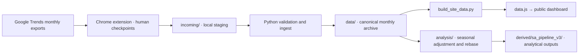

# Google Trends Toolkit

**Nitisart Srijunpho** · Economic research and AI-assisted data tooling

**CV reference:** Experience → Bank of Thailand, Northeastern Region Office → Cooperative Education Student, Economic Research (Apr–Jul 2026)

[Live dashboard](https://reload0981-ops.github.io/google-trends-toolkit/) · [Data engineering guide](docs/DATA_ENGINEERING.md) · [Monthly update runbook](docs/OPERATIONS.md#monthly-update-ทางการ) · [Portfolio / CV guide](https://github.com/reload0981-ops)

## Purpose and my contribution

This toolkit turns repeated Google Trends downloads into a traceable monthly archive and an explorable labour-search dashboard. It grew out of my economic research co-op at the Bank of Thailand's Northeastern Region Office.

My work connects the economic question, keyword selection, source validation and interpretation with the collection workflow and dashboard. I use AI coding agents to develop and maintain the software and check its outputs against source data.

**Evidence in this repository:** a Chrome extension for collection, Python queue/ingest/audit tools, a documented analytical pipeline, tests, and a public dashboard. The related [research comparison dashboard](https://github.com/reload0981-ops/isan-labor-interactive) is another output of the same research work.

## Data flow

Collection runs in the user's authenticated Chrome profile. Python handles queues, validation, ingestion and transformation. Collection still includes human checkpoints; the dashboard is a published snapshot.

## Repository guide

| Layer | Location | Responsibility |
|---|---|---|
| Definitions | [keywords.csv](keywords.csv), [reference/](reference/) | Active keyword IDs and research screening history |
| Collection | [extension/](extension/), [collector/](collector/) | Export queue, CSV ingestion and data-quality checks |
| Canonical data | [data/](data/) | Monthly series and collection catalog |
| Transformation | [analysis/](analysis/) | T1/T2 construction, seasonal adjustment, rebasing and centred MA3 |
| Analytical outputs | [derived/sa_pipeline_v3/](derived/sa_pipeline_v3/) | Series, diagnostics, quality flags and source-hash manifest |
| Presentation | [index.html](index.html), [data.js](data.js) | Interactive keyword and geography comparison |
| Operation and checks | [scripts/](scripts/), [tests/](tests/), [.github/workflows/validate.yml](.github/workflows/validate.yml) | Runbook entrypoint, regression tests and gated deployment |

## Published scope

The snapshot inspected on **10 September 2026** contains **51 keywords × 6 collected geographies = 306 series**. The six collected geographies are Thailand and five Isan provinces; the dashboard also offers a computed Isan composite. Data runs through **July 2026**, collected on **6 August 2026**.

The broader co-op research covered 20 Isan provinces. This public toolkit exposes a selected five-province dataset and must be read at that scope.

Google Trends values measure relative search interest. Zero or weak signal does not establish an absence of labour demand. The raw dashboard composite and the seasonal-adjustment dataset have different transformation and support rules; see the [data engineering guide](docs/DATA_ENGINEERING.md).

## Use and maintenance

Open the [live dashboard](https://reload0981-ops.github.io/google-trends-toolkit/) to explore the existing snapshot. For a local view, open `index.html`; the page loads its data from `data.js`.

For installation, collection and monthly updates, follow the [Thai operations runbook](docs/OPERATIONS.md). For analytical methods, use [analysis/README.md](analysis/README.md). Agents must read [AGENTS.md](AGENTS.md) and [SKILL.md](SKILL.md).

Maintain source and derived data through the documented pipeline. The runbook distinguishes production collection from diagnostic tools and records the checks required before a data release.

## Attribution

Project contributor and maintainer: **Nitisart Srijunpho**. Developed with AI coding assistance. Research context: Bank of Thailand, Northeastern Region Office, 2026. Source data originates from Google Trends; institutional and data-source attribution remains separate from software contribution.
